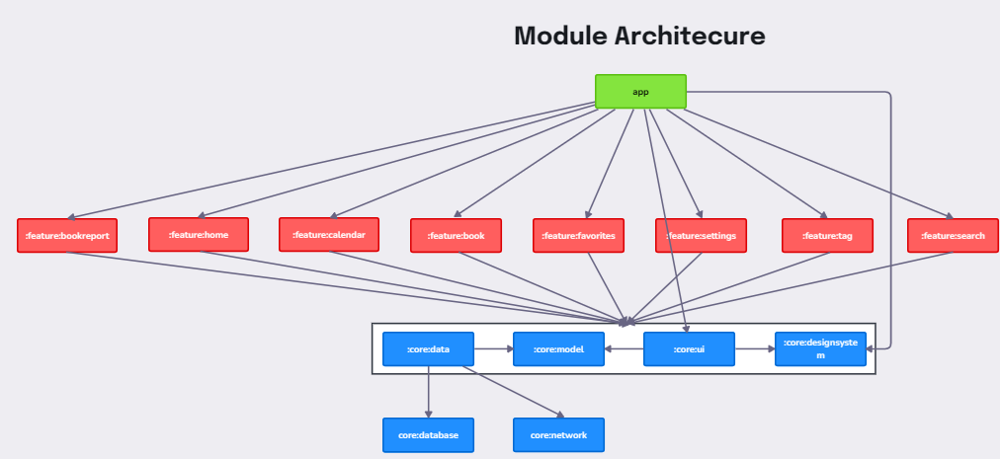

# 프로젝트 소개
독후감을 작성하고 관리할 수 있는 서비스를 제공합니다. 도서와 태그를 선택해 독후감에 추가하여 내용과 함께 저장할 수 있습니다.
[Google 권장 아키텍처](https://developer.android.com/topic/architecture?hl=ko&_gl=1*1kcgipb*_up*MQ..*_ga*MTgwMzU4NjM3Mi4xNzI1MDIyNzE3*_ga_6HH9YJMN9M*MTcyNTAyMjcxNy4xLjAuMTcyNTAyMjcxNy4wLjAuMA..) 및 [now in android](https://github.com/android/nowinandroid/tree/main) 를 참고하고 있습니다.

## 핵심 기능
- 독후감 저장
- 독후감 및 도서 즐겨 찾기
- 도서 검색 및 상세 정보 확인
- 독후감에 사용할 태그 생성

## 모듈 아키텍처

| **이름** | **책임** |
| --- | --- |
| feature: … | 특정 기능을 담당하며 기능과 관련된 UI 요소와 ViewModel 을 포함 되어 있습니다. |
| core:data | data source 에 접근하여 feature 에 필요한 데이터를 제공합니다. UI 계층에서 사용하기 수월하도록 model 을 맵핑하는 등의 비지니스 로직이 포함 되어 있습니다. |
| core:designsystem | material 3 를 기반으로 사용하며, 핵심적인(테마 등) UI 구성요소에 대한 정의가 포함되어 있습니다. |
| core:ui | 여러 feature 에서 사용되는 UI 요소를 포함합니다. designsystem 과 달리 model 모듈에 대한 의존성을 가지고 model 을 렌더링 합니다. |
| core:database | Room 을 사용하여 로컬 data source 를 저장 및 관리합니다. |
| core:network | Retrofit 을 이용해 remote data source 에 대한 네트워크 요청 및 응답을 처리합니다. |
| core:model | 앱 전체에서 사용되는 모델을 포함하는 모듈입니다.  |

## Tech
Kotlin, Coroutine + Flow
Compose, Hilt, Retrofit, Glide, Navigation, Room
Android Clean Architecture, multi module, MVVM
Junit4